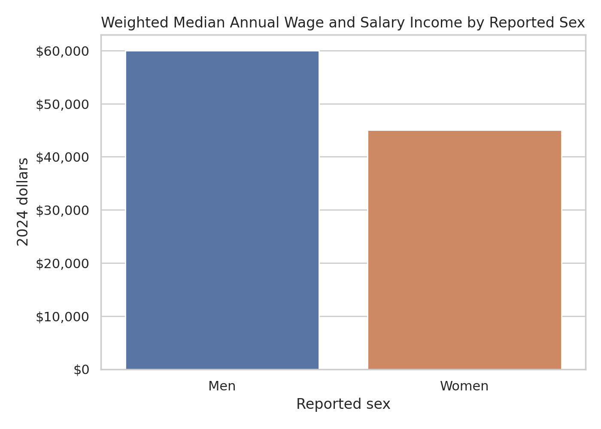
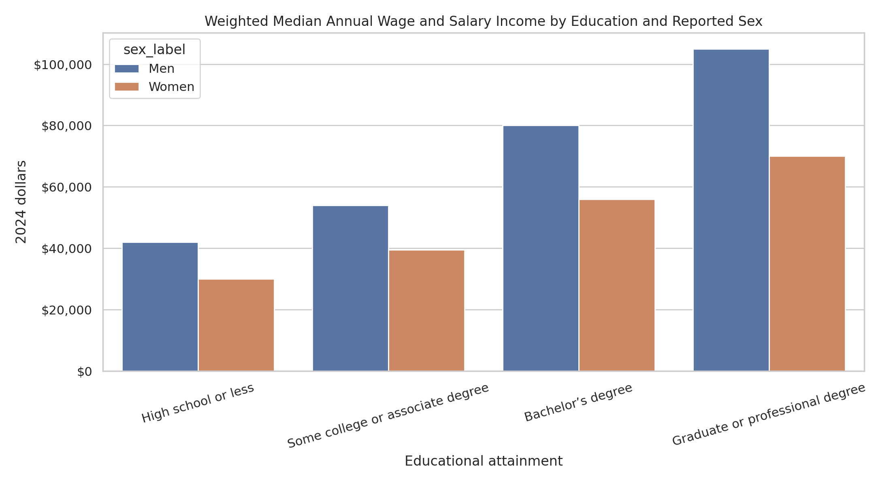
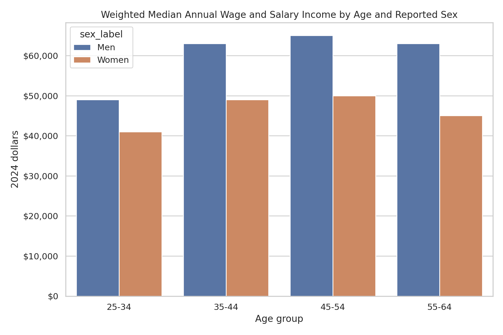

# Project 1: Exploring the Gender Pay Gap in North Carolina

## Context and research question

The gender pay gap is the observed difference in earnings between groups of workers. It can reflect many overlapping factors, including occupation, industry, education, work patterns, caregiving, discrimination, and labor-market history. This project is a descriptive exploratory data analysis; it identifies patterns in survey data but cannot prove that any one factor causes a difference in pay.

**Research question:** Among North Carolina residents ages 25-64 with positive wage and salary income, how do weighted median annual wage and salary incomes differ by reported sex, and how do those differences vary by educational attainment and age?

## Data source and unit of analysis

This project uses the U.S. Census Bureau's **2024 American Community Survey 1-Year Public Use Microdata Sample (ACS PUMS) API**. The API request is limited to North Carolina (`state:37`). Each row is one sampled person, not a payroll record or every person in the state.

| Dataset detail | Description |
|---|---|
| Source | U.S. Census Bureau, 2024 ACS 1-Year PUMS API |
| Geography | North Carolina |
| Unit of analysis | One sampled person |
| Initial size | 114,270 downloaded person records |
| Final analytic size | 41,436 person records after analytic filters |
| Missing/excluded values | 72,834 records were excluded by the analytic filters. `AGEP`, `SEX`, `WAGP`, `SCHL`, `WKHP`, `WKWN`, and `PWGTP` had no missing values; `OCCP` and `INDP` each had 46,413 missing values. |

## Variables and operational definitions

| Concept | ACS field | How it is used |
|---|---|---|
| Reported sex | `SEX` | Comparison variable. ACS records this as a binary sex code; it is not a measure of all gender identities. |
| Wage and salary income | `WAGP` | Main outcome: wage/salary income during the previous 12 months, in dollars. It is not total compensation, hourly pay, benefits, or self-employment income. |
| Education | `SCHL` | Grouped as high school or less, some college/associate degree, bachelor's degree, or graduate/professional degree. |
| Age | `AGEP` | Restricted to ages 25-64 and grouped into four age ranges for comparison. |
| Occupation | `OCCP` | Retained as an occupation recode for a future occupation-specific comparison. Code labels must be verified with ACS documentation before reporting occupational findings. |
| Industry | `INDP` | Retained as an industry recode for a future industry-specific comparison. Code labels must be verified with ACS documentation before reporting industry findings. |
| Work pattern | `WKHP`, `WKWN` | Usual weekly hours and weeks worked during the past 12 months. They provide context about work patterns. |
| Survey weight | `PWGTP` | Person weight used for weighted descriptive summaries. |

### Important measurement caveat

The ACS PUMS API does **not** provide a direct "years of work experience" variable. Age, weeks worked, and hours worked are not the same as years of work experience. This project therefore does not claim to control for experience; it uses age and work-pattern variables only as context.

## Data cleaning with pandas

The notebook downloads the fields above with `requests` and pandas. It converts API text fields to numbers, checks missing values, and retains respondents who are 25-64 years old, have positive wage/salary income, have a valid `SEX` value, a valid education code, and a positive survey weight. Of 114,270 downloaded records, 41,436 met these criteria; 72,834 were excluded. It creates readable education and age groups, then saves a cleaned CSV.

### Cleaning trade-offs

Keeping only people with positive wage/salary income makes wage comparisons more interpretable, but excludes people with no wage income. The analysis also does not include self-employment income in the outcome. These decisions may change the population represented by the results and are reported rather than hidden.

## Visualizations and findings

The analysis produced three weighted-median visualizations using the 41,436-record analytic sample.

### Figure 1: Wage and salary income by reported sex

Figure 1 shows a weighted median annual wage and salary income of approximately $60,000 for men and $45,000 for women, an observed difference of about $15,000. This comparison describes the sample after the project filters; it does not identify the cause of the difference.

### Figure 2: Wage and salary income by education and reported sex

Figure 2 shows higher weighted median wage and salary income for men in every education group. The observed differences were $12,000 for high school or less, $14,500 for some college or an associate degree, $24,000 for a bachelor's degree, and $35,000 for a graduate or professional degree. The gap does not disappear at higher education levels in this descriptive comparison.

### Figure 3: Wage and salary income by age group and reported sex

Figure 3 shows an observed difference in every age group: $8,000 for ages 25-34, $14,000 for ages 35-44, $15,000 for ages 45-54, and $18,000 for ages 55-64. Across the groups shown, the observed difference becomes larger later in the working-age range.

## Interpretation

Across the full analytic sample, men have a higher weighted median annual wage and salary income than women. The difference is present across the education and age groups shown, though its size varies. The largest visible difference occurs among respondents with graduate or professional degrees, and the age comparison shows a larger difference among the oldest group in this analysis. These are descriptive patterns, not evidence that reported sex alone caused the observed differences. Occupation, industry, work history, work schedules, caregiving, discrimination, and other unmeasured factors may contribute to the results.

## Limitations, ethics, and unanswered questions

- ACS `SEX` is binary and does not represent every gender identity.
- This analysis is descriptive. It does not establish that reported sex causes any observed income difference.
- Wage/salary income does not include benefits, hourly rate, total compensation, or self-employment income.
- The data are survey data, so results are subject to sampling and reporting error.
- Occupational and industry codes require verified code labels before they can support interpretable occupation/industry conclusions.
- Direct years of work experience are unavailable in this dataset.
- The project reports group-level patterns and does not make claims about any individual person's ability, effort, or worth.

## Code, reproducibility, and AI use

The underlying code is available in [the Jupyter notebook](https://github.com/nreddi2/data-science-portfolio/blob/main/analysis/gender_pay_gap_acs.ipynb). It documents data collection, cleaning, weighting, and visualization steps.

**AI disclosure:** Generative AI was used to help organize the site and draft the analysis workflow.

## References

Blau, F. D., & Kahn, L. M. (2017). The gender wage gap: Extent, trends, and explanations. *Journal of Economic Literature, 55*(3), 789-865. https://doi.org/10.1257/jel.20160995

England, P. (2010). The gender revolution: Uneven and stalled. *Gender & Society, 24*(2), 149-166. https://doi.org/10.1177/0891243210361475

Goldin, C. (2014). A grand gender convergence: Its last chapter. *American Economic Review, 104*(4), 1091-1119. https://doi.org/10.1257/aer.104.4.1091

U.S. Census Bureau. (2024). *American Community Survey 1-Year Public Use Microdata Sample API*. https://www.census.gov/data/developers/data-sets/census-microdata-api/acs-1y-pums.html

U.S. Census Bureau. (2024). *2024 ACS PUMS data dictionary*. https://www.census.gov/programs-surveys/acs/microdata/documentation/2024.html
